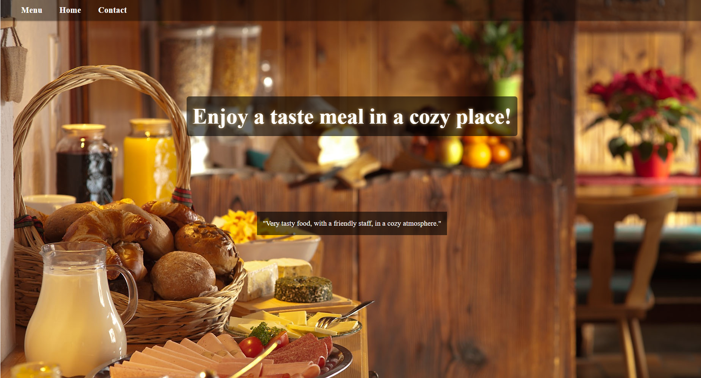

# Le House
> A restaurant page.



<br>This is a desktop webpage, build mainly to practice the webpack workflow and DOM manipulation.<br>

## Content

* [Live Demo](#live-demo)
* [Requirements](#requirements)
* [Built With](#built-with)
* [Getting Start](#getting-start)
* [Contributing](#contributing)
* [Acknowledgments](#acknowledgments)
* [Author](#author)
* [License](#license)

## Live Demo
You can access a deployed version of this app:<br>
https://raw.githack.com/SevlaMare/LeHouse/feature-implementation/dist/index.html

## Requirements
- [x] Setup webpack to build all from source(src) to distribuition(dist) folder
- [x] Setup npm/yarn scripts to linters, server and webpack build
- [x] Implement tabs, move between them using HTML, CSS and JS only


## Pre-requisites
<ul>
	<li>Node</li>
	<li>Npm</li>
	<li>Yarn</li>
	<li>Web browser</li>
</ul>

## Setup

Download all dependencies with
```js
npm install
```

Start the server with
```js
yarn go
```

Visit the app running on
```js
localhost:7000
```

## Built With

- Javascript<br>
- HTML/CSS <br>
- Webpack <br>
- ESlint and Stylint (Linters) <br>
- GitHub Actions (CI Tool) <br>
- Git, Github and VScode <br>

## Possible features

- Make responsive
- Refine CSS adding more modern effects
- Render the menu items from a database
- Optimize the code removing the redundances
- Use handlebars for HTML template

## Getting Start

To use this program, you will need only a web browser like google crome.

#### Get a local copy
Now you need a copy of this application, if you are using Git:
```js
git clone git@github.com:SevlaMare/LeHouse.git
```
Otherwise just hit (Download Zip) on green button (Clone or Download) at top of this page.

#### Run it live
You can just drag and drop index.html to your browser.

### Contributing

Contributions, issues and feature requests are welcome!

You can do it on [issues page](issues/).

## Acknowledgments

A special thanks for the code reviewers.

## Author

👤 **Thiago Miranda**

- Github: [@SevlaMare](https://github.com/SevlaMare)
- Twitter: [#SevlaMare](https://twitter.com/SevlaMare)
- Linkedin: [SevlaMare](https://www.linkedin.com/in/sevla-mare)

### License
<strong>Creative Commons • Ago 2020</strong>
